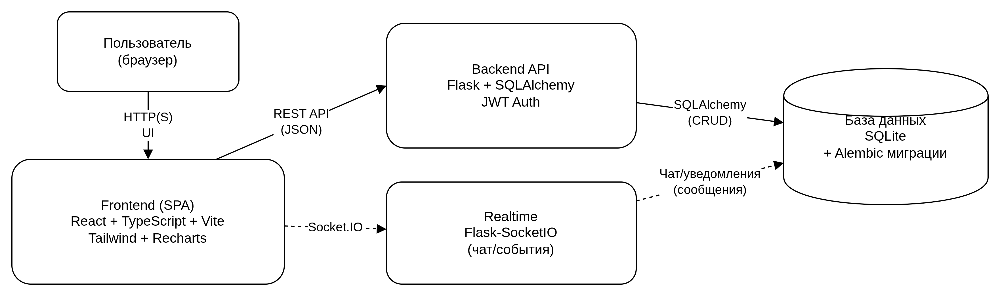
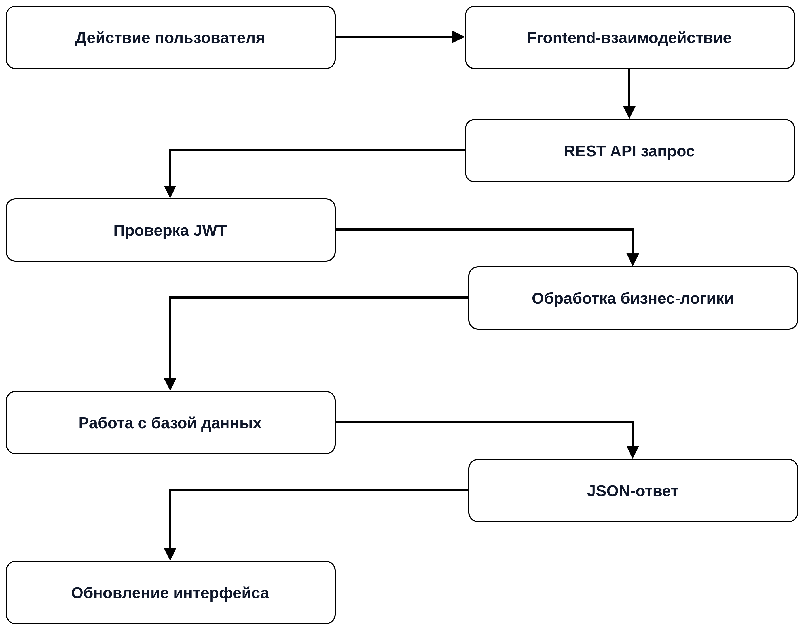

# 🚀 Разработка веб-приложения для автоматизации управления задачами и клиентской базой в сервисной компании

Полнофункциональное full-stack веб-приложение, разработанное в рамках:
- НИРс-1
- НИРс-2
- выпускной квалификационной работы (ВКР)

Проект предназначен для автоматизации бизнес-процессов сервисной компании:
- управления клиентской базой;
- планирования сервисных работ;
- назначения сотрудников;
- контроля выполнения задач;
- внутреннего взаимодействия сотрудников;
- аналитики и мониторинга деятельности компании.

---

# 📌 Описание проекта

Во многих сервисных компаниях управление заявками и клиентами осуществляется с использованием:
- электронных таблиц;
- бумажных журналов;
- телефонных звонков;
- мессенджеров.

Подобный подход приводит к:
- потере данных;
- ошибкам при планировании;
- несогласованности информации;
- сложности контроля задач;
- отсутствию централизованной аналитики.

Целью проекта является создание специализированной информационной системы для автоматизации управления сервисными процессами и клиентской базой.

---

# 🏗 Архитектура системы

Система реализована на основе клиент-серверной архитектуры.



## Архитектурные особенности
- SPA (Single Page Application)
- REST API
- JWT-аутентификация
- ролевая модель доступа
- WebSocket-взаимодействие
- модульная архитектура
- централизованная обработка данных

---

# ⚙️ Используемые технологии

## Frontend
- React
- TypeScript
- Vite
- Tailwind CSS
- Axios
- Recharts
- Socket.IO Client

## Backend
- Flask
- Flask-JWT-Extended
- Flask-SQLAlchemy
- Flask-Migrate
- Flask-SocketIO
- SQLAlchemy ORM

## База данных
- SQLite
- Alembic migrations

---

# 👥 Роли пользователей

| Роль | Возможности |
|---|---|
| Администратор | Полное управление системой, сотрудниками, клиентами, задачами и аналитикой |
| Исполнитель | Работа только с назначенными задачами и внутренним чатом |

---

# ✨ Основной функционал

## 🔐 Аутентификация и безопасность
- JWT-аутентификация
- разграничение прав доступа
- защита API
- хеширование паролей
- проверка ролей пользователей

## 👨‍💼 Управление сотрудниками
- создание сотрудников
- изменение ролей
- удаление сотрудников
- управление правами доступа

## 👥 Управление клиентами
- ведение клиентской базы
- хранение контактной информации
- история обслуживания
- поиск и фильтрация клиентов

## 📅 Управление задачами и расписанием
- создание сервисных задач
- назначение сотрудников
- изменение статусов
- планирование работ
- отслеживание выполнения задач

## 📊 Аналитика
- KPI-показатели
- графики активности
- аналитика выручки
- мониторинг производительности сотрудников

## 💬 Встроенный чат
- обмен сообщениями в реальном времени
- приватные диалоги
- статус прочтения сообщений
- Socket.IO взаимодействие

---

# 🧩 Основные модули системы

| Модуль | Назначение |
|---|---|
| Модуль аутентификации | Авторизация пользователей и JWT |
| Модуль сотрудников | Управление сотрудниками и ролями |
| Модуль клиентов | Управление клиентской базой |
| Модуль задач | Планирование и выполнение задач |
| Модуль аналитики | Отображение статистики и KPI |
| Модуль сообщений | Внутренний чат сотрудников |

---

# 🗂 Структура проекта

```text
graduation-project/
│
├── backend/
│   ├── app.py
│   ├── base.py
│   ├── config.py
│   ├── extensions.py
│   ├── generator_reader.py
│   ├── models.py
│   ├── seed_admin.py
│   ├── user.py
│   ├── requirements.txt
│   ├── testFile.csv
│   │
│   ├── migrations/
│   ├── instance/
│   └── __pycache__/
│
├── frontend/
│   ├── dist/
│   ├── node_modules/
│   ├── public/
│   ├── src/
│   ├── index.html
│   ├── package.json
│   ├── package-lock.json
│   ├── postcss.config.cjs
│   ├── tailwind.config.cjs
│   ├── tsconfig.json
│   ├── tsconfig.node.json
│   ├── vite.config.ts
│   ├── vercel.json
│   └── yarn.lock
│
└── README.md
```

---

# 🌐 REST API

## Аутентификация
```http
POST /token
POST /logout
GET /profile
```

## Сотрудники
```http
GET /employees
POST /employees/create
POST /employees/delete
POST /employees/permission
```

## Клиенты
```http
POST /customer/display
POST /customer/create
POST /customer/details
POST /customer/delete
```

## Задачи и расписание
```http
POST /service/create
POST /service/details
POST /schedule/display
POST /schedule/edit
POST /schedule/complete
```

## Аналитика
```http
GET /api/admin/metrics
GET /api/admin/activity
GET /api/dashboard/revenue_over_time
```

## Чаты
```http
GET /api/conversations/<user_id>
POST /api/conversations
```

---

# 🗃 Структура базы данных

Основные сущности:
- сотрудники;
- клиенты;
- сервисные задачи;
- назначения сотрудников;
- сообщения;
- расписание.

База данных поддерживает:
- связи между сущностями;
- историю обслуживания;
- управление задачами;
- контроль выполнения операций.

---

# 🔄 Процесс обработки данных



---

# 💻 Локальный запуск проекта

## Frontend

```bash
cd frontend

npm install

npm run dev
```

Frontend будет доступен по адресу:

```text
http://localhost:5173
```

---

## Backend

```bash
cd backend

python -m venv .venv

source .venv/bin/activate

pip install -r requirements.txt

python app.py
```

Backend будет доступен по адресу:

```text
http://127.0.0.1:5000
```

---

# 🔑 Переменные окружения

## Frontend

Создать файл:

```text
frontend/.env.local
```

Содержимое:

```env
VITE_API_URL=http://127.0.0.1:5000
```

---

## Production Frontend

Создать файл:

```text
frontend/.env.production
```

Содержимое:

```env
VITE_API_URL=https://your-backend-url.onrender.com
```

---

## Backend

```env
SECRET_KEY=your_secret_key
JWT_SECRET_KEY=your_jwt_secret
```

---
---

# 🔒 Механизм аутентификации

1. Пользователь выполняет вход в систему
2. Backend проверяет данные пользователя
3. Генерируется JWT-токен
4. Токен сохраняется на frontend
5. Защищённые запросы отправляются с Authorization Header
6. Backend проверяет JWT перед выполнением операций

---

# 📊 Административная панель

Администратор имеет доступ к:
- аналитике;
- KPI-показателям;
- активным проектам;
- управлению сотрудниками;
- управлению задачами;
- мониторингу деятельности компании.

---

# 💬 Система обмена сообщениями

В проекте реализован обмен сообщениями в реальном времени на основе Flask-SocketIO.

Поддерживаются:
- приватные диалоги;
- обновление сообщений без перезагрузки страницы;
- статус прочтения;
- уведомления;
- синхронизация сообщений.

---

# 🧠 Научно-исследовательская часть

Проект основан на результатах:
- НИРс-1;
- НИРс-2;
- анализа существующих FSM-систем;
- IDEF0-моделирования;
- проектирования клиент-серверной архитектуры;
- анализа REST API взаимодействия.

В рамках проекта были разработаны:
- функциональные модели;
- архитектурные схемы;
- диаграммы декомпозиции;
- ролевая модель доступа;
- модели обработки данных.

---

# 📈 Возможности дальнейшего развития

Планируемые улучшения:
- переход на PostgreSQL;
- Docker-контейнеризация;
- мобильное приложение;
- push-уведомления;
- email-уведомления;
- файловые вложения;
- расширенная аналитика;
- облачное хранение данных;
- геолокация сотрудников.

---

# 📄 Лицензия

Проект разработан в учебных и научно-исследовательских целях.

Все права защищены © Ahmed Kashima